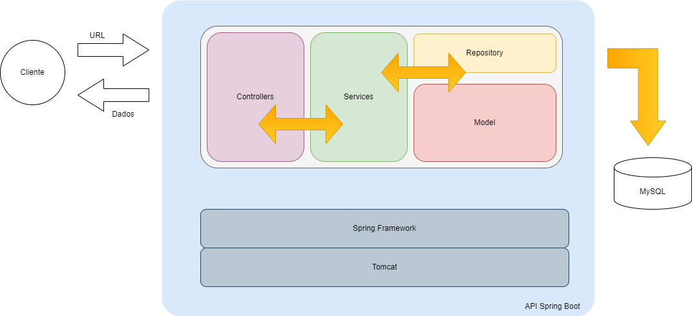
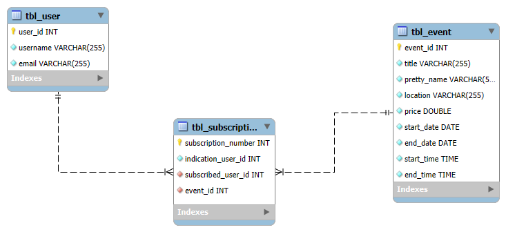

# 🚧 API Events Manager - Em construção... 🚧
Este projeto demonstra a construção de uma [API RESTful]([https://aws.amazon.com/pt/what-is/restful-api/]) robusta e eficiente utilizando principalmente a linguagem Java, o framework web Spring Boot e um banco de dados MySQL para o gerenciamento de eventos, assim como seus inscritos, data e hora de início e término, entre outros. A API apresenta os principais endpoints para a construção de um arquitetura sólida baseada nas boas práticas.

*   **[GET] /events:** Lista todos os eventos;
*   **[GET] /events/{prettyName}:** Retorna um evento específico com base na busca do nome formatado;
*   **[POST] /events:** Cria um novo evento;
*   **[PUT] /events/{prettyName}:** Atualiza um evento existente;
*   **[DELETE] /events/{prettyName}:** Remove um evento

# Diagrama de Deployment

# DER 

# Sumário
   * [Tecnologias](#️-ferramentas-e-tecnologias-utilizadas)
   * [Sobre a aplicação](#️-sobre-a-aplicação)
   * [Instalação](#️-instalação)
   * [Execução da aplicação](#-execução)
   * [Contribuição](#-contribuição)

# Ferramentas e tecnologias utilizadas
*   **Java:** Linguagem de programação back-end;
*   **Spring Boot:** É um framework Java de código aberto que simplifica o desenvolvimento de aplicações web e microsserviços com o Spring Framework, oferecendo uma série de recursos que facilitam a criação de aplicações robustas e prontas para produção com o mínimo de configuração manual;
*   **MySQL:** Banco de dados relacional para persistência de dados;
*   **Docker:** Plataforma open-source que permite o empacotamento do software, proporcionando escalabilidade e independência de unidades executáveis;
*   **Insomnia:** Plataforma utilizada para realização de testes de endpoints;

# Contribuição
Contribuições são sempre bem-vindas! Se você tiver ideias para melhorar este projeto, sinta-se à vontade para abrir uma issue ou enviar um pull request