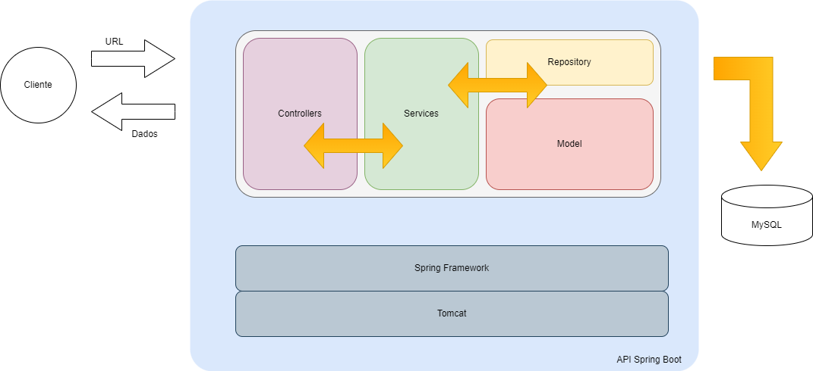
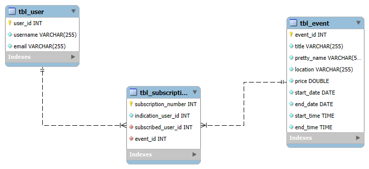

# 🚧 API Events Manager - Em construção... 🚧
Este projeto demonstra a construção de uma [API RESTful]([https://aws.amazon.com/pt/what-is/restful-api/]) robusta e eficiente utilizando principalmente a linguagem Java, o framework web Spring Boot e um banco de dados MySQL para o gerenciamento de eventos, assim como de inscrições, usuários indicadores, data e hora de início e término, entre outros. A API apresenta os principais endpoints para a construção de um arquitetura sólida baseada nas boas práticas.

Para eventos:
*   **[GET] /events:** Lista todos os eventos;
*   **[GET] /events/{prettyName}:** Retorna um evento específico com base na busca do nome formatado;
*   **[POST] /events:** Cria um novo evento;

Para inscrições:
*   **[POST] /subscription/{prettyName}:** Realiza a inscrição de um usuário em um evento;
*   **[POST] /subscription/{prettyName/{userId}}:** Realiza a inscrição de um usuário em um evento, fornecendo o usuário indicador

# Sumário
   * [Tecnologias](#️ferramentas-e-tecnologias-utilizadas)
   * [Diagrama de Deployment](#️diagrama-de-deployment)
   * [DER](#️der)
   * [Sobre a aplicação](#️sobre-a-aplicação)
   * [Instalação](#️instalação)
   * [Execução da aplicação](#execução)
   * [Contribuição](#contribuição)

# ⚒️ Ferramentas e tecnologias utilizadas
*   **Java (Versão 21):** Linguagem de programação back-end;
*   **Spring Boot:** Framework Java de código aberto que simplifica o desenvolvimento de aplicações web e microsserviços com o Spring Framework, oferecendo uma série de recursos que facilitam a criação de aplicações robustas e prontas para produção com o mínimo de configuração manual;
*   **MySQL:** Integração com o framework JPA e JDBC para conexão com o banco de dados para persistência dos dados;
*   **Docker:** Plataforma open-source que permite o empacotamento do software, proporcionando escalabilidade e independência de unidades executáveis;
*   **Insomnia:** Teste de funcionamento da API.

# Diagrama de Deployment


A imagem representa o fluxo de requisições e dados em uma aplicação Spring Boot, desde o cliente (navegador) até o banco de dados MySQL. As camadas (controladores, serviços, repositórios e modelos) estão dispostas de forma organizada, facilitando a compreensão da estrutura da aplicação.

1. Componentes principais:
Cliente: O usuário que faz requisições através de um navegador (Chrome, Firefox, etc.);

URL: A Uniform Resource Locator, ou "endereço web", que identifica o recurso solicitado;

Controladores (Controllers): Os "porteiros" da aplicação, que recebem as requisições e as direcionam para os serviços apropriados;

Serviços (Services): O "coração" da aplicação, onde residem as regras de negócio e a lógica de processamento;

Repositórios (Repositories): Os "intermediários" entre os serviços e o banco de dados, responsáveis por persistir e recuperar dados;

Modelos (Models): As representações das entidades de negócio, que refletem a estrutura do banco de dados;

MySQL: O banco de dados relacional utilizado para armazenar os dados da aplicação.

2. IOC e DI:
A imagem destaca o papel fundamental do Spring Framework, que fornece a base para o Spring Boot, incluindo os recursos de Inversão de Controle (IoC) e Injeção de Dependência (DI). O Tomcat, um servidor web popular, também é mencionado como o ambiente de execução padrão para aplicações Spring Boot.

3. Fluxo de requisição e resposta:
A imagem ilustra o fluxo de requisição e resposta:
- O cliente faz uma requisição através de uma URL;
- A requisição é interceptada por um controlador;
- O controlador delega a lógica para um serviço;
- O serviço interage com um repositório para acessar ou persistir dados;
- Os dados são processados e retornados para o controlador;
- O controlador envia a resposta em formato JSON para o cliente

4. Complementos:
Injeção de Dependência (DI): Pode-se inferir que o Spring Framework gerencia as dependências entre as classes, injetando os componentes necessários nos serviços e controladores;
Camada de Apresentação: A imagem foca principalmente nas camadas de backend, mas é importante lembrar que a aplicação também possui uma camada de apresentação (não mostrada na imagem) responsável por exibir os dados ao usuário. 
Essa camada pode ser construída com tecnologias como Thymeleaf, JSP, React, Angular, etc.

# DER 


# Sobre a aplicação
Implementação de um sistema de indicações com ranking dos usuários que mais convidaram pessoas para o evento.

## Instalação
- Primeiramente, clone o repositório:
```
git clone https://github.com/david-castanheira/events-manager-api.git
```

- Acesse a pasta do projeto no terminal ou CMD:
```
cd events
```

## 🚀 Execução da aplicação
- Inicie o servidor Tomcat através do comando Maven (certifique-se de o ter instalado localmente) no terminal:
```
mvn spring-boot:run
```

- A aplicação estará disponível na porta 8080:
```
http://localhost:8080/
```

# 🤝 Contribuição
Contribuições são sempre bem-vindas! Se você tiver ideias para melhorar este projeto, sinta-se à vontade para abrir uma issue ou enviar um pull request